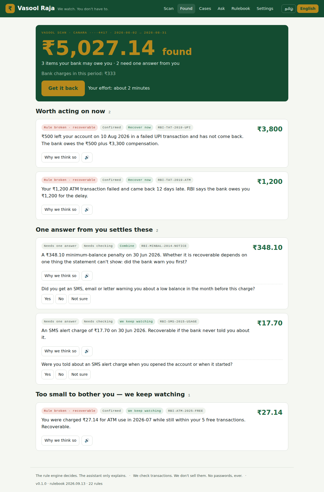

# Vasool Raja — the money guardian

**A Regulatory Digital Twin for Indian bank customers.** Give it a bank statement or a passbook photo; it runs the RBI rulebook on it, tells you what your bank may owe you — with the rule beside every rupee — prepares the complaint, and tracks it on the statutory clock. In Tamil, by voice, through a trusted family member if needed.

> *"Bank rule theriyadhaa? Vasool Raja paathukkum."* — Don't know the bank rules? Vasool Raja checks them for you.

Built by **Mad Angles, Coimbatore Institute of Technology** for HackVerse 2.0 (Digital Twins & FinTech), Karpagam College of Engineering.



## What it does

| Pillar | What happens |
|---|---|
| **Watch** | Statement PDF/CSV/XLSX or a passbook photo in. Parsed on the server, stored only as normalised transactions, deletable any time. No passwords, ever. |
| **Expose** | Every line classified (ATM, UPI, charge, penalty, reversal…), failed debits paired to their reversals — including partial and batched ones. |
| **Prove** | ~20 RBI rules, each versioned by effective date and cited to its circular, compare *what should have happened* with *what did*. The difference is the claim. |
| **Recover** | Findings labelled 🔴 recoverable / 🟡 avoidable / ⚪ needs one answer, scored by Recovery Priority, bundled into one complaint pack (bank letter + RBI Ombudsman draft + evidence table), tracked on the 30-day clock with a closed loop on the next statement. |
| **Protect** | Legal-but-avoidable charges come with how to stop the next one — including your right to a zero-charge Basic account. |
| **Guardian** | The account holder is called first, in Tamil. One trusted person gets one message with one button. Nothing is sent until a human taps. |
| **History** | Upload as many statements of an account as you have — months, quarters, a passbook page. Overlaps are de-duplicated, gaps are named, and the rules run on the *whole* history (a June penalty is judged on May's balances). Every account you have scanned stays in the local database with what was found and what came back. |
| **Real delivery** | Optional. With a Gmail app password in `.env`, the guardian's one-button message and the complaint copy go out as real emails — to a *person*, never to a bank (`VASOOL_DEMO_TO` redirects every mail to one safe address). The guardian taps **Yes, send** on their phone; the laptop screen moves to *Sent to the bank* by itself. |
| **Paper** | Every case prints as an A4 complaint — letter, numbered claims with the RBI reference and arithmetic, signature block, bank acknowledgement box, Annexure A with the statement lines — plus the RBI Ombudsman draft. *Print / Save as PDF* from the browser; take two copies to the branch. |

**The rule engine decides. AI only explains.** "Ask Vasool Raja" answers questions from the account's own findings, cases and the rulebook; it cannot create a claim. A ₹50,000 college fee is never flagged — there is no anomaly detection, only compliance checking.

## Run it

```bash
pip install -r requirements-dev.txt          # Python 3.10+; tesseract-ocr for passbook photos
python scripts/make_samples.py               # synthetic statements in Canara / SBI / HDFC export shapes
python scripts/make_passbook_image.py        # a printed passbook page for the OCR path
uvicorn api.main:app --reload --port 8000    # → http://localhost:8000  (API docs at /docs)
```

Or `docker compose up --build`.

Command line:

```bash
python -m vasool scan data/samples/canara_amma_pension_2026.csv --bank CANARA --min-balance 500 --as-of 2026-09-13
python -m vasool rules --on 2025-04-30
```

Tests (35, including every trap case): `python -m pytest -q`

### Passbook photos (OCR)

Photo/scan reading uses the Tesseract OCR engine. Windows: install it from https://github.com/UB-Mannheim/tesseract/wiki (keep the default folder) and restart the server — it is found automatically. Without it, photos are refused with a clear message and PDF/CSV still work. Point `VASOOL_TESSERACT` at `tesseract.exe` if you installed it somewhere unusual.

## The 90-second demo

1. **Scan** → pick the *Canara Amma* sample → *Check my account*.
2. **₹5,027 found.** Two failed transactions the bank owes ₹100/day on; one minimum-balance penalty that needs one answer; one ATM charge inside the free allowance that's too small to bother you with.
3. Tap **Why we think so** on any card: expected vs actual, the calculation, the RBI circular with a link, the statement lines.
4. Answer *"Did you get a low-balance warning?"* → **No** → the penalty becomes recoverable and the total rises.
   *Or* scroll to **Statements → Add another statement** and add *canara amma pension 2026 mar may* (the previous quarter): 18 new lines, 2 duplicates skipped, and the same penalty becomes **Confirmed** on its own — May's balances never fell below ₹500, so no question is needed. That is what the Digital Twin gains from a longer history.
5. **Get it back** → complaint prepared, nothing sent. **Print complaint** opens the A4 letter with Annexure A, ready for the branch counter.
6. **Ask my guardian** → Amma's phone rings (Tamil, play it aloud) → Kumar's WhatsApp mock with one button → **Approve as Kumar** → *Sent to the bank. We're watching the 30-day clock.* With email configured (see `docs/DEMO.md`), Kumar's real phone gets the mail instead; he taps **Yes, send the complaint** and the laptop screen changes on its own.
7. **Ask** → *"why did the bank charge me 295?"* — answered from the finding, grounded on the rule id.
8. **History** lists every account scanned on this machine; open any of them to continue.
9. Scan the *SBI Arun* sample to show the traps the engine gets right: a partial reversal within T+5 (no claim), a ₹25 charge judged by the ₹21 cap in force that month, a 6th withdrawal marked *allowed*, a same-amount retry that is *asked about*, never claimed.

The recovery at the end of the flow is **simulated** in the demo (the *Money came back* button, or upload a later statement to *Check next statement for the refund*). Say the word before anyone asks.

## Repository

```
rulebook/rules.json      the open rulebook — rule, circular, date, effective window, formula, evidence, questions
rulebook/schema.json     JSON schema (validated in CI)
vasool/                  engine: parsers → classify → pairing → twin → rules → priority → complaint → cases → guardian → assistant
api/main.py              FastAPI: scan, answers, cases, approvals, guardian, ask, claims, samples
web/static/              the app (vanilla JS, Tamil/English, voice in and out via the browser)
data/samples/            synthetic statements + passbook image (clearly labelled)
tests/                   golden tests for every sample, trap and boundary; API loop test
scripts/                 sample generators, headless UI walkthrough (Playwright)
docs/                    ARCHITECTURE.md · RULEBOOK.md · PRIVACY.md · screenshots
```

## Honest limits

* **Data access.** Today: upload or photo. Automatic watching needs RBI's Account Aggregator, which only regulated entities may use — production rides on a partner bank/NBFC. The engine is AA-ready (it consumes normalised transactions); the demo does not pretend otherwise.
* **Recovery.** Not every rupee comes back. Findings say which are yours by law (statutory compensation, undisclosed penalties) and which are legal but avoidable. Legal charges recover nothing; we prevent instead.
* **Passbook OCR** is conservative: it reports a quality score and asks for a retake rather than guess.
* **Working days** for card-closure / gold-release rules are Mon–Fri; bank holidays are not modelled, and the complaint says so.
* **Rules marked `suggest`** raise a "needs checking" finding only, until a second reviewer confirms the text and date. Every rule links to its source; open every link before you rely on it.

## Licence

Apache 2.0. The rulebook is open data — copy it, audit it, correct it.
